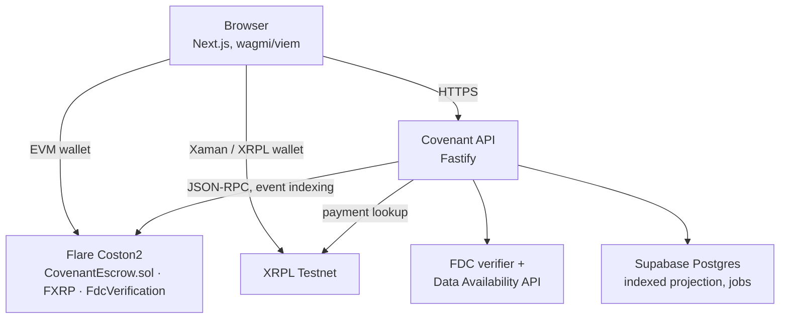

# Covenant

Covenant is a collateralized payment commitment protocol: a payer locks a smaller FXRP bond on Flare, and Flare's Data Connector decides whether that bond returns to the payer or moves to the recipient based on what actually happened on XRPL. This Coston2 deployment uses FTestXRP as its test collateral token; Covenant's production design refers to this collateral generically as FXRP.

## The problem

- A promised future XRP payment on XRPL has no enforcement mechanism — the recipient has only the payer's word until the payment arrives or the deadline passes.
- Pre-funding the full amount through an XRPL escrow removes the trust problem, but forces the payer to lock 100% of the payment upfront, which is often impractical.
- There is no neutral, automated way to attach a consequence to a broken promise without either full collateral or a trusted intermediary.

## Solution

- The payer locks a smaller FXRP bond on Flare, not the full XRP amount. The bond is collateral for the promise, not a copy of the payment.
- The XRP itself never touches Covenant. It moves directly between XRPL accounts, exactly like any other XRPL payment.
- Settlement is decided by Flare evidence, not a server or a company. A verified Flare Data Connector (FDC) proof of either a matching payment or its provable absence is the only thing `CovenantEscrow` accepts as grounds for settlement.

**Why Flare is essential:**

- **FDC Payment proof** — attests a specific XRPL payment happened, including source, destination, delivered amount, and payment reference. `settlePaid` only accepts a proof whose fields exactly match the commitment's stored terms, verified against the Merkle root Flare's validators finalized.
- **ReferencedPaymentNonexistence** — attests no payment matching a reference, destination, and minimum amount exists within a finalized XRPL ledger range. This is what lets `settleDefault` prove a negative without trusting any single party's claim.
- **FXRP** — the bridged representation of XRP on Flare that makes the bond possible at all.
- **Coston2** — Flare's public testnet, where the escrow contract, FXRP, and the FDC system are deployed and exercised for this project.

No off-chain service in Covenant can mark a commitment fulfilled or defaulted. The contract only moves the bond after an independent, cryptographically checked proof passes every field comparison, and it computes the recipient itself — never supplied by whoever submits the proof.

## How it works

1. **Set the terms.** The payer defines the recipient, the XRP amount, the FXRP bond, and a payment deadline.
2. **Lock the bond.** The payer approves and transfers the FXRP bond into `CovenantEscrow`, which mints a commitment ID and a unique 32-byte payment reference derived from the chain, the contract, the payer, and that ID.
3. **Pay with the protected reference.** The payer sends a direct XRP payment on XRPL to the committed destination, for the committed amount, with the generated reference as the transaction's sole memo. The reference is generated by the app and never typed by hand.
4. **Settle from evidence.** Once a matching FDC `Payment` proof exists, anyone can submit it and the bond returns to the payer. If the deadline passes with no matching payment, an FDC `ReferencedPaymentNonexistence` proof lets the bond move to the recipient instead.

## Architecture



- **Frontend** (`apps/web`): connects the wallet, enforces the Coston2 network, builds the guided commitment flow, renders the contract's state, and never holds a key or secret.
- **XRPL**: carries the actual payment. Covenant only ever reads XRPL, through the API's read-only client; it has no custody path.
- **API/executor** (`apps/api`): indexes `CovenantEscrow` events into Supabase, generates the exact XRPL payment payload, observes reported transactions, and runs the FDC job pipeline that requests and submits proofs. It can hold a gas-only Coston2 key that cannot redirect settlement funds.
- **Supabase**: stores a searchable projection of on-chain events, FDC job state, and XRPL observations. It is a cache and job queue, not the source of truth; the contract's own state always wins.
- **FDC**: Flare's Data Connector, the system that produces the `Payment` and `ReferencedPaymentNonexistence` proofs the contract requires before it will move a bond.
- **Covenant contract** (`CovenantEscrow.sol`): holds the FXRP bond, computes the payment reference, and is the only component that decides where a bond goes.

See `docs/ARCHITECTURE.md` for trust boundaries and failure handling in more detail.

## Live deployment

| Component | URL                                                         | Host                          |
| --------- | ----------------------------------------------------------- | ----------------------------- |
| Frontend  | [covenant-web.solutionkanu206128.workers.dev][frontend-url] | Cloudflare Workers (OpenNext) |
| API       | [covenant-cb9g.onrender.com][api-url]                       | Render                        |

The frontend proxies `/api/*` server-side to the API above; the browser never calls the API origin directly.

`CovenantEscrow` is live on Flare Coston2 (chain ID `114`):

| Contract              | Address                                      | Explorer                    |
| --------------------- | -------------------------------------------- | --------------------------- |
| CovenantEscrow        | `0x841F714A57Ba1B1A77ef8b3732aCf825D593f017` | [View][exp-escrow]          |
| FTestXRP (collateral) | `0x0b6A3645c240605887a5532109323A3E12273dc7` | [View][exp-ftestxrp]        |
| FdcVerification       | `0x906507E0B64bcD494Db73bd0459d1C667e14B933` | [View][exp-fdcverification] |

Deployment block `34013106`, deployment transaction [`0x87d72a97...5477a61ce2c3`][tx-deploy], gas used `2590405`. See `docs/DEPLOYMENT.md` for the full production topology and required environment variables.

[frontend-url]: https://covenant-web.solutionkanu206128.workers.dev
[api-url]: https://covenant-cb9g.onrender.com
[exp-escrow]: https://coston2-explorer.flare.network/address/0x841F714A57Ba1B1A77ef8b3732aCf825D593f017
[exp-ftestxrp]: https://coston2-explorer.flare.network/address/0x0b6A3645c240605887a5532109323A3E12273dc7
[exp-fdcverification]: https://coston2-explorer.flare.network/address/0x906507E0B64bcD494Db73bd0459d1C667e14B933
[tx-deploy]: https://coston2-explorer.flare.network/tx/0x87d72a97049a4f549dcef2777db2a780b1bb95d29bfd385470115477a61ce2c3

## Demo evidence

Two real commitments have been settled against the live contract above — not fixtures, not seeded data.

| Commitment | Outcome   | FDC proof                       | Settlement transaction                | Bond movement                          |
| ---------- | --------- | ------------------------------- | ------------------------------------- | -------------------------------------- |
| #0         | Fulfilled | `Payment`                       | [`0xe9df8246...78f7edf93e4`][tx-0]    | 1 FTestXRP bond returned to the payer  |
| #1         | Defaulted | `ReferencedPaymentNonexistence` | [`0xd633cc12...d2b104c8d6857b`][tx-1] | 1 FTestXRP bond moved to the recipient |

Both transactions are `settlePaid`/`settleDefault` calls that only succeeded because a genuine FDC proof passed every field check against the commitment's stored terms — see the live deployment above to look up either commitment directly.

[tx-0]: https://coston2-explorer.flare.network/tx/0xe9df824696bfaec87818853f9913bb3c6511aa088e3b2199de2a478f7edf93e4
[tx-1]: https://coston2-explorer.flare.network/tx/0xd633cc12652eba5d3121c1401fc4dbb0cf4a332445eea2d1c5d2b104c8d6857b

## Security architecture

- **The contract decides settlement, not the backend.** `settlePaid` and `settleDefault` each independently recompute every required field from the submitted FDC proof and compare it against the commitment's own stored terms. Only `FdcVerification.verifyPayment` / `verifyReferencedPaymentNonexistence` returning true, on top of every field check passing, allows a transfer.
- **The backend cannot choose the recipient.** `settlePaid` always pays the commitment's recorded payer; `settleDefault` always pays the commitment's recorded beneficiary. Whoever submits the proof transaction has no influence over where funds go.
- **Replay protection.** Each payment reference is derived on-chain from the chain ID, contract address, payer, and a monotonic commitment ID, and is marked used at creation, so a caller cannot reuse or pre-reserve one. A commitment can only be read by `_activeCommitment` and settled while `status == Active`; both settlement paths flip status before any external call and revert `CommitmentNotActive` on a second attempt.
- **Reference, destination, and amount validation.** Both settlement functions check `standardPaymentReference`, `receivingAddressHash` / `destinationAddressHash`, and the received or requested amount against the commitment's stored values before accepting a proof; a proof for the wrong payment, wrong destination, or insufficient amount is rejected with `ProofFieldMismatch`.
- **Timing validation.** `settlePaid` rejects a payment finalized after `deadlineTimestamp` or outside `[minimalLedger, deadlineLedger]`. `settleDefault` reverts `DefaultTooEarly` until the deadline has passed, and its nonexistence proof must cover the exact deadline ledger and timestamp the commitment recorded.
- **API-side validation.** Every route validates its inputs (commitment id, wallet address, status, XRPL transaction hash format) before touching the database, and the payment-request endpoint takes only the recipient's XRPL address from the caller; the amount and reference always come from the indexed on-chain commitment, never from the request body, and the supplied destination must hash-match the commitment's own `xrplDestinationHash`.
- **Internal routes are gated.** `POST /api/indexer/sync` requires a constant-time comparison against a server-only `INTERNAL_API_SECRET`. Admin routes require both a valid Supabase access token and a server-managed `profiles.is_admin` flag; clients cannot set that flag themselves.
- **Secrets never committed.** `.env` is git-ignored; `.env.example` documents variable names only. The optional Coston2 executor key is gas-funded only, cannot custody user funds, and cannot redirect a settlement, since the contract computes the recipient itself.

See `docs/SECURITY.md` for the full breakdown, including known limitations.

## Repository structure

```text
apps/
  api/        Fastify backend — event indexer, XRPL client, FDC job executor
  web/        Next.js frontend (App Router)
packages/
  contracts/  CovenantEscrow.sol and its Foundry unit/invariant tests
  shared/     Cross-package constants (deployment addresses, chain config)
supabase/     SQL migrations and seed data (local development only, not the live evidence above)
docs/         Architecture, deployment, security, and phase-by-phase provenance
```

## Quickstart

Requirements: Node.js 20+, pnpm 10.15.0, Foundry (`forge`), and a Supabase project for the API.

```bash
pnpm install
cp .env.example .env   # see docs/DEPLOYMENT.md for required and optional variables
pnpm --filter @covenant/api dev    # http://localhost:3001
pnpm --filter @covenant/web dev    # http://localhost:3000
```

Or skip local setup entirely and use the live deployment above.

See `docs/DEPLOYMENT.md` for the full environment variable reference and production topology.

## Testing

- Contract tests (Foundry): **26/26 passing** (`packages/contracts/test/CovenantEscrow.t.sol`, `CovenantEscrow.invariant.t.sol`)
- API unit and integration tests: **61/61 passing** (`pnpm --filter @covenant/api test`)
- Web unit tests: **38/38 passing** (`pnpm --filter @covenant/web test`)
- Lint: passing (`pnpm lint`)
- Typecheck: passing (`pnpm typecheck`, all workspaces)

## Limitations

- Covenant is a collateralized payment commitment, not insurance. It does not reimburse a payer or recipient beyond the value of the FXRP bond that was actually locked.
- Covenant does not guarantee the full XRP payment arrives. It guarantees that a bond consequence follows from verifiable evidence about whether the payment arrived, nothing more.
- Covenant never custodies XRP. XRP moves directly between XRPL accounts; the contract only ever holds the FXRP bond.
- There is currently no separate configurable cure period beyond the contract's payment deadline.
- This is a Coston2 testnet deployment using test FXRP and XRPL Testnet funds. No mainnet deployment exists.

## Provenance

See [`docs/PROVENANCE.md`](docs/PROVENANCE.md) for the commit-by-commit build history of this repository.
